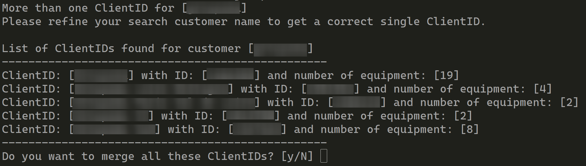
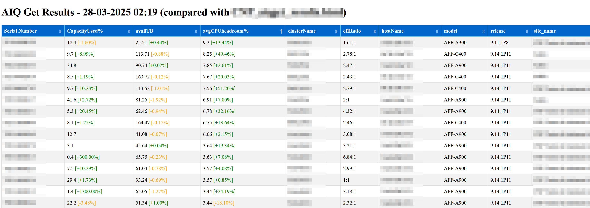
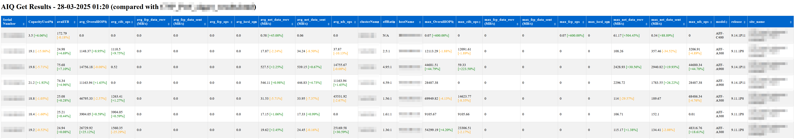

# AIQget

AIQget is a Python CLI which retrieve information from ActiveIQ.NetApp.com for ONTAP serialnumber

AIQget is a python script which retrieve the following information from AIQ:

    average current CPU Headroom for the last 31 days (default)
    efficiency ratio
    % capacity used
    capacity available

All columns are sortable

It use Python 3.10.

You just need to provide a comma-separated list of the serialnumber you want:

example: 
`python3 aiget.py --serialnumber 211941000138,211941000137 --customer ACME --refresh_Token <your refresh token>`

It will then generate an HTML file with associated results named : 

`ACME_aiqget_results.html`

Script will also rename existing HTML file

You can also provide only your `customer_name` (in quotation marks if there are spaces in the name) and the script will search for all ONTAP serial numbers (E-series and StorageGRID are not currently supported).

`python3 aiqget.py --customer_name "we build some stuff" --refresh_Token <you refresh token>`

If the script detects several clients matching the name provided, it will either suggest you refine your search and start again, or merge all serial numbers into a single table.

`refresh_Token` is a required parameter

You must register ActiveIQ API services to get a refresh_Token before running this script.  
Go to [activeiq.netapp.com/api](https://activeiq.netapp.com/api)  
Click on generate token and respond the questions  
  
To obtain your access_Token and refresh_Token

If the script finds a previous version of the HTML results,\
 it will analyze it and add the percentage variation for each counter to the newly generated file.\
This allows you to quickly see the trend for each serial number and counter.\
Each column of the generated HMTL file are sortable.\
And the column HostName can be filtered to search for particular controler.

Example of basics results :

Example of results with all performances counters :

The other script **UpdatePPTX.py** allow you to update a predefined powerpoint presentation\
where you have defined some shape with name corresponding to:\
headroom_`<hostname`>\
capacity_`<hostname`>\
\
(currently only headroom and capacity value are searched)

So, the script will search for corresponding shape and modify its value from the value\
contained in the HTML table generated by aiqget.py

Example of shape naming inside powerpoint:\

Then you can run updatepptx.py with the following options:
* [`--replace-inplace`]   a boolean argument 

    _if present_, it allow you to search inside all your slides from a PPTX file.\
    and then replace, directly inside, the corresponding value

    _if not present_, you need to provide a PPTX file, with the last slide as your reference slide\
    and updatePPTX.py will copy this last slide as a new last one, and updated it with\
    corresponding values from you HMTL file.

* `<path to PPTX file`>   the path to your PPTX file
* `<path to HTML file`>   the path to your HTML file

